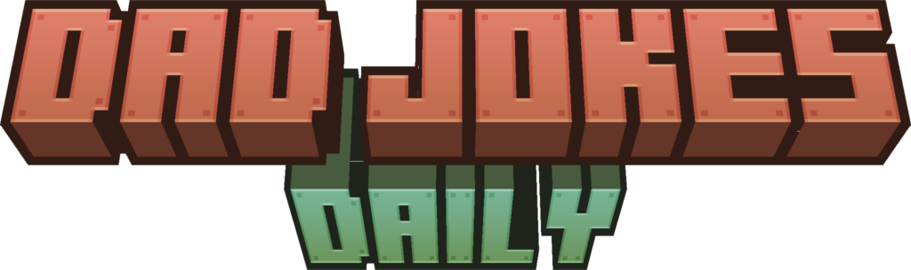

    

    
    

# Daily Dad Jokes

A Minecraft mod, and server plugins that tell dad jokes when player join

## Installation

### Bukkit

You have 2 options:

- Use `dailydadjokes-bukkit-<version>.jar` (a fat JAR) if you don't want to install dependencies. In return, it's quite heavy.
- Use `dailydadjokes-bukkit-<version>-noshade.jar`, it is lightweight. In return, you have to install [MCKotlin](https://github.com/4drian3d/MCKotlin) and [MCCoroutine](https://github.com/Shynixn/MCCoroutine/releases).

## License

Licensed under the [MIT](./LICENSE) license.
